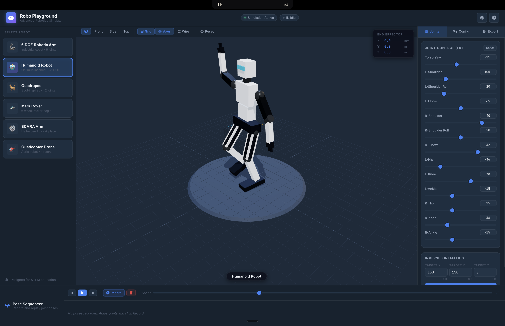

<div align="center">

# 🤖 Robo Playground — Advanced Robotics Simulator

**A browser-based, zero-install robotics simulation platform for students, hobbyists, and engineers.**

[](https://mayurvarma14.github.io/robo-playground)
[](LICENSE)
[](https://threejs.org)
[]()

*Simulate, control, and 3D-print real robots — right from your browser.*

</div>

<br/>
<div align="center">
  
</div>
<br/>

---

## ✨ What is Robo Playground?

Robo Playground is a **fully client-side** robotics simulation environment built with pure HTML, CSS, and Three.js — no frameworks, no build steps, no installs. It was built with one goal: give students and beginners a **realistic, hands-on way to explore robotics** without needing expensive hardware or complex software.

Every robot model is **procedurally generated with accurate proportions**, uses **Physically-Based Rendering (PBR) materials**, and can be **exported as a print-ready STL file** compatible with any 3D slicer (Cura, PrusaSlicer, Bambu Studio).

---

## 🤖 Robot Models

| Robot | Type | Degrees of Freedom | Inspired By |
|-------|------|--------------------|-------------|
| **6-DOF Robotic Arm** | Industrial Cobot | True 6 revolute + Gripper | Universal Robots UR5e (published DH dims, limits, speeds) |
| **Humanoid Robot** | Bipedal | 13 (arms + legs + torso) | Tesla Optimus |
| **Quadruped** | Legged Robot | 12 (3 per leg) | Boston Dynamics Spot |
| **Mars Rover** | Wheeled Mobile | 6 wheels + sample arm | NASA Perseverance |
| **SCARA Arm** | Pick & Place | 4 (2 rotary + Z + tool) | Epson T-Series |
| **Quadcopter Drone** | Aerial Robot | 4 rotors | DJI-style FPV |
| **Dexterous Bimanual Arm** | Bimanual Manipulator | 20 (Shared L/R + 10 fingers) | Shadow Robot / Tesla Optimus Hands |

---

## 🎮 Features

### 🕹️ Joint Control (Forward Kinematics)
Independently control every joint via real-time sliders with numeric inputs. Values are clamped to realistic joint limits — no impossible poses.

### 🎯 Real Inverse Kinematics
Industry-style IK across all seven robots, driven by a draggable 3D target gizmo or numeric pose fields:

- **6-DOF arm** — full-pose (position + orientation) damped-least-squares Jacobian IK over a Denavit–Hartenberg model anchored to published UR5e dimensions, limits, and joint speeds
- **SCARA** — closed-form analytical IK with an elbow left/right configuration toggle and Z-slide clamping
- **Quadruped** — body-pose mode: drag or rotate the body while per-leg 3-DOF analytical IK keeps all four feet planted
- **Humanoid** — per-limb 2-link analytical reach with level-foot ankle compensation and a ground-projected COM marker that turns red outside the support polygon
- **Bimanual arm** — per-side numeric position IK on shoulder pitch/yaw + elbow
- **Mars rover** — Perseverance-style 4-corner-wheel Ackermann steering with turn-radius control and per-wheel angles
- **Drone** — virtual thrust/yaw and pitch/roll stick pads feeding a standard X-quad motor mixer with live per-motor output bars

Unreachable targets keep the best-effort pose and tint the target red — the same behavior as a real teach pendant. Joint limits are enforced inside the solver, and damping guarantees no exploding poses near singularities.

### 🧠 Expert Mode
A header toggle reveals the math driving the simulation: a live DH parameter table (θ updates as joints move), end-effector pose and 4×4 transform matrix, and a Yoshikawa manipulability bar with a singularity warning. Per-robot extras include quadruped foot positions, drone mixer outputs, and rover steer geometry. A Frames toolbar button overlays an RGB axis triad on every joint frame, and the end effector leaves a motion trace as it tracks the IK target.

### 📐 Configurable Dimensions
Every robot's link lengths, body proportions, and actuator sizes are configurable through live sliders — changes rebuild the model in real time.

### 📦 STL Export (3D Print Ready)
Export any individual named part or the full robot assembly as a binary STL file. Files are watertight and compatible with all major slicer software. Print tolerance settings (bolt hole diameter, wall thickness) are configurable before export.

### 🎬 Pose Sequencer
Record any number of robot poses and play them back as a smooth interpolated animation. Control playback speed from 0.1× to 3.0×.

### 🌗 Dark / Light Mode
Toggle between a dark slate-blue engineering theme and a bright laboratory light theme. Preference persists across sessions via `localStorage`.

### 📷 Multiple Camera Views
Switch between Isometric, Front, Side, and Top orthographic views. Orbit, pan, and zoom with mouse or trackpad. Soft dampening for smooth camera feel.

---

## 🚀 Getting Started

### Option 1 — Open directly (zero setup)
```
Just open index.html in any modern browser.
```
No server required. The app loads Three.js via CDN.

### Option 2 — Serve locally (recommended for development)
```bash
npx serve .
```
Or use any static file server:
```bash
python3 -m http.server 8080
```
Then open `http://localhost:8080`.

### Option 3 — GitHub Pages
Fork this repo, go to **Settings → Pages**, set the source to `main` branch, root directory — the app is instantly live.

---

## 🏗️ Architecture

The entire app is ~3,800 lines of plain JavaScript split into 8 focused modules:

```
robo-playground/
├── index.html          # App shell, layout, UI markup
├── css/
│   └── styles.css      # Full design system (CSS variables, dark/light modes)
└── js/
    ├── main.js         # App controller — UI wiring, state, sequencer, export
    ├── viewport.js     # Three.js scene — camera, lights, IK gizmo, frame triads
    ├── robots.js       # All 7 robot builders + joint/param/kinematics configs
    ├── kinematics.js   # Pure-math engine: DH FK, numeric Jacobian, DLS IK,
    │                   #   analytical solvers, Ackermann, quad mixer (zero deps)
    ├── ik-control.js   # Per-robot IK interaction: gizmo, sticks, solver wiring
    ├── expert-panel.js # Live DH table, EE pose/matrix, manipulability readouts
    ├── tests.js        # Browser test harness — open with ?test=1 (38 tests)
    └── materials.js    # Shared PBR material library (metal, rubber, carbon fibre…)
```

**No bundler. No transpiler. No package.json.** Three.js is imported via browser [Import Maps](https://developer.mozilla.org/en-US/docs/Web/HTML/Element/script/type/importmap).

---

## 🔧 How It Works

### Procedural Geometry
Every robot is built at runtime from Three.js primitives — `BoxGeometry`, `CylinderGeometry`, `SphereGeometry`, `ExtrudeGeometry` — assembled into named `THREE.Group` hierarchies. This means:
- **No external model files** (.glb, .fbx) to download
- **Every part is individually selectable** and exportable
- **Dimensions are parametric** — changing a slider rebuilds the mesh

### PBR Materials
All materials are `MeshStandardMaterial` with calibrated `roughness` and `metalness` values to simulate real-world surfaces: brushed aluminium, anodised alloy, polished chrome, carbon fibre, rubber tyres, and white polycarbonate body panels.

### Lighting Rig
A 6-light studio rig provides even, realistic illumination with no glare:
1. **Ambient** — prevents pitch-black undercuts
2. **Hemisphere** — sky/ground bounce light
3. **Key (Sun)** — main directional with soft PCF shadows
4. **Fill** — cool-toned counter-light from opposite side
5. **Rim** — warm back light for robot/background separation
6. **Under-fill** — subtle upward light for underside visibility

### STL Export
Uses Three.js's built-in `STLExporter` to write binary STL. The mesh hierarchy is traversed to export individual named parts separately — useful for splitting a robot into printable subassemblies.

---

## 📚 Educational Use

Robo Playground was designed with STEM education in mind:

- **No coding required** — students can explore immediately
- **No hardware cost** — runs on any laptop or Chromebook
- **Accurate proportions** — models are designed to realistic mm-scale dimensions
- **3D printable** — students can bring their configurations into the real world
- **DH parameters** — the same Denavit–Hartenberg convention taught in every robotics course, live in expert mode
- **Jacobian & DLS IK** — a readable damped-least-squares solver, the method real industrial controllers use
- **Singularities** — watch the manipulability bar collapse as the arm stretches out
- **Static stability** — the humanoid's ground-projected COM against its foot support polygon
- **Ackermann steering** — per-wheel steer angles and turn radius, Perseverance-style
- **Pose sequencer** — introduces the concept of trajectory planning

---

## 🤝 Contributing

Contributions are welcome! Some ideas for improvement:

- [ ] Add more robot types (delta robot, cable-driven, parallel manipulator)
- [ ] Physics simulation using [Rapier.js](https://rapier.rs/docs/user_guides/javascript/)
- [ ] URDF import/export support
- [ ] Collision detection and workspace boundary visualization
- [ ] Mobile touch gesture support
- [ ] Saving/loading robot configurations as JSON

Please open an issue before submitting a large PR so we can discuss the approach.

---

## 📝 License

MIT — see [LICENSE](LICENSE) for details. Free to use for personal, educational, and commercial purposes.

---

<div align="center">

Made with ❤️ by [Mayur Varma](https://github.com/mayurvarma14)

*If this helped your robotics learning journey, consider giving it a ⭐*

</div>
